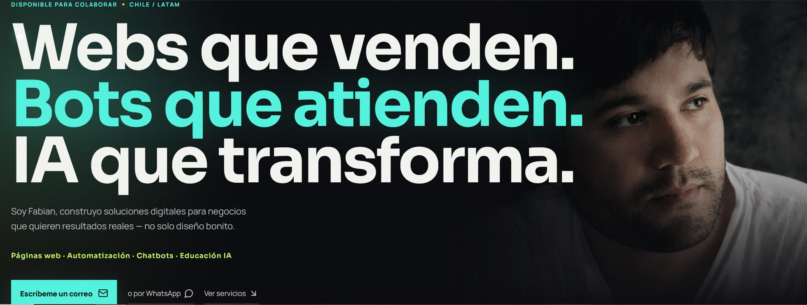

  

<h1 align="center">Fabian Lizana Leyton · Portfolio</h1>

  <strong>Webs que venden. Bots que atienden. IA que transforma.</strong>

  Soluciones digitales para negocios que quieren resultados reales — no solo diseño bonito.

  <a href="https://portfolio.fabianlizana.dev">🌐 Ver sitio</a>
  &nbsp;·&nbsp;
  <a href="mailto:fabianlizana1870@gmail.com">✉️ Contacto</a>
  &nbsp;·&nbsp;
  <a href="https://www.linkedin.com/in/fabian-andres-lizana-leyton-307119247/">💼 LinkedIn</a>

---

## 🚀 ¿Qué incluye?

- **Páginas Web** — Landing pages, portafolios, tiendas online. Rápidas, responsive, optimizadas para convertir.
- **Chatbots Inteligentes** — Asistentes 24/7 para WhatsApp y web que atienden clientes sin intervención humana.
- **Automatización** — Procesos repetitivos automatizados: tareas, flujos, notificaciones e integración con APIs.
- **Educación en IA** — Talleres prácticos para equipos que quieren aplicar inteligencia artificial en su día a día.

## 🛠️ Stack

  
  
  

## 📁 Proyectos destacados

| Proyecto | Categoría | Resultado |
|----------|-----------|-----------|
| Sushi Local | Web | Diseño de marca + menú digital · +15% consultas WhatsApp |
| Saber De Sabor | Web | Landing page con carta interactiva · carga en 1.2s |
| Landing Page Premium | Web | Marca + tienda online completa · diseño oscuro premium |
| Chatbot Inteligente | Automatización | Asistente 24/7 para atención al cliente |
| Gestión de Redes | Social Media | Planificación y generación de contenido con IA |

---

  Hecho con ❤️ por <a href="https://github.com/FabianLizana">Fabian Lizana</a>

